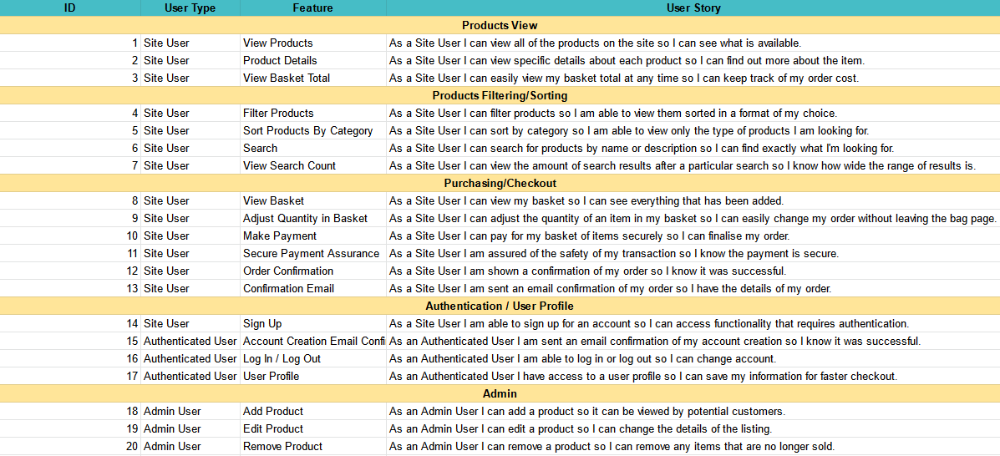

# Tone Henge

Tone Henge is a full-stack eCommerce project built using Django, Heroku and AWS.

## UX/UI

### User Stories

User stories are seen in the below table.

This sheet is used for mapping user stories to features and epics throughout development. [It can be viewed here](https://docs.google.com/spreadsheets/d/1ob8nIBe4SKKu7h6s5SPkJSnqiatEzivwf0XZelbFMKs/edit?usp=sharing).

## Testing

Testing information can be found in [this dedicated document](readme/testing/TESTING.md).

## Marketing

-   [View Facebook business page mockup.](/readme/marketing/facebook.pdf)
-   A Mailchimp embedded newsletter form has been included.

## Credit

Credit to [Ian Lunn](https://github.com/IanLunn/) for the code I used to animate the home page hero image button.
