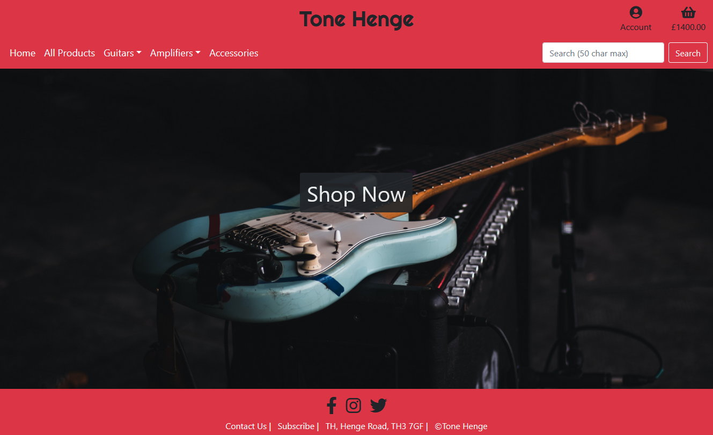
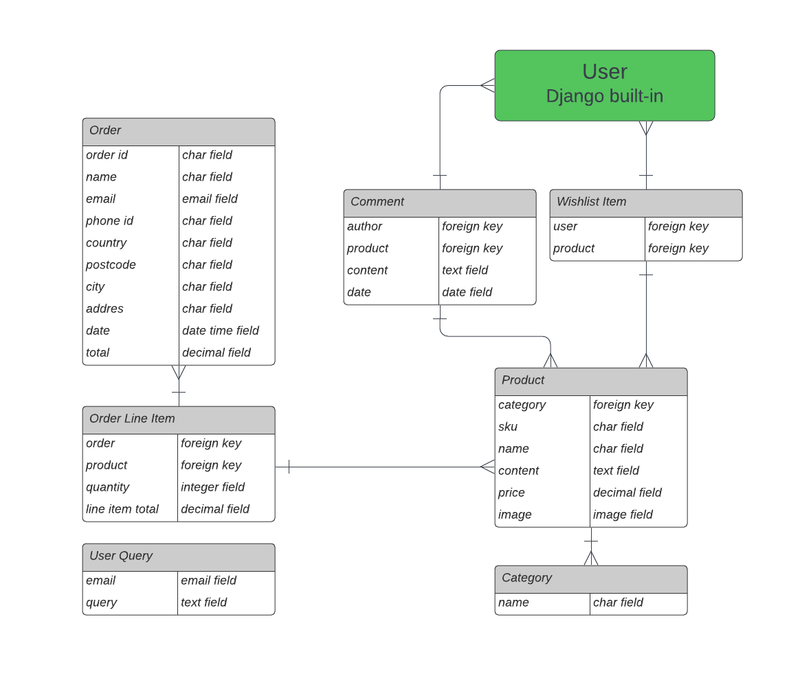

# Tone Henge



Tone Henge is a full-stack eCommerce project built using Django, Heroku and AWS.

## UX/UI

### User Stories

User stories are seen in the below table.


This sheet is used for mapping user stories to features and epics throughout development. [It can be viewed here](https://docs.google.com/spreadsheets/d/1ob8nIBe4SKKu7h6s5SPkJSnqiatEzivwf0XZelbFMKs/edit?usp=sharing).

### Wireframes

Wireframes assisted keeping to the basic design of the project. These also helped out map the UI in advance. These can be seen [here](readme/general/wireframes.pdf).

### Typography / Colour Scheme

Use of minimal, recurring fonts and colours enforces the brand's consistency across pages. The default font is Helvetica Neue. The font for the logo is bold and eye-catching. The choice for this was Righteous.

The main colours used across the app are red (#dc3545), white (#fff) and a dark grey (#212529). These are consistent with Bootstrap styling for seamless integration.

## Database

The schema diagram can be seen below.



### Models

-   Order
    -   Used for storing information regarding a single order. Created upon successful payment.
-   Order Line Item
    -   Stores information about a single product from an order.
    -   Foreign key to Order.
    -   Foreign key to Product.
-   User Query
    -   Stores an email and user query. This is not referenced, nor does it reference any other models.
-   Comment
    -   Store a comment by a particular user on a specific product page.
    -   Foreign key to User (Django built-in).
    -   Foreign key to Product.
-   Wishlist Item
    -   Points to a particular user and specific product. A user can add multiple of these, which can be back-referenced from the User model and iterated through to show a wishlist.
    -   Foreign key to User (Django built-in).
    -   Foreign key to Product.
-   Product
    -   Holds information regarding a specific, unique product.
    -   Foreign key to Category.
-   Category
    -   Holds only a single, unique field: 'name'. Can be added to multiple products.

## Testing

Testing information can be found in [this dedicated document](readme/testing/TESTING.md).

## Marketing

### Purpose

Tone Henge is made for people looking to purchase instruments online, made easy by simple yet effective UI and UX design. There is also a community aspect of the app, with users being able to comment on products, potentially opening up discussions around items.

### Business Model

Tone Henge is based on a B2C (business to consumer) ecommerce model, where the business in practice would deal and ship directly to the end-user. While it is possible that other businesses, such as schools or music venues, would purchase from the site, they would still effectively be the end-user, and Tone Henge would remain the direct and sole seller of the stock.

### Marketing Strategy

As this is a new business, the main focus is on audience growth and building a strong brand presence amongst potential customers.

In practice, the primary marketing strategy for this application would be social media marketing. This would likely involve both paid and non-paid ad campaigns, targeting a specific demographic of potential customers. The business would initially need to investigate which platforms this demographic is most densely populated on, and begin targeted campaigns.

Users of the site are able to sign up to the newsletter on all pages across the app. This allows for tailored promotions straight to the inbox of users.

-   [View Facebook business page mockup.](/readme/marketing/facebook.pdf)
-   A Mailchimp embedded newsletter form has been included.

## Deployment

This project is deployed to Heroku. It was initially set up on the Heroku website, but hooked up to the git repo via the Heroku CLI.

Steps for deployment:

-   Install Django and relevant dependencies.
-   Create new Django project with appropriate Procfile for Heroku.
-   Run:
    ```
    pip freeze --local > requirements.txt
    ```
-   Ensure all code is committed to Git.
-   Navigate to Heroku, login, and click "create a new app".
-   Enter a unique name for the application, and select the appropriate region.
-   Add PostgreSQL 'hobby' database as a resource. The URL is automatically added to config vars.
-   In the Heroku config vars, ensure 'DEVELOPMENT' is set to 'True' and 'DISABLE_COLLECTSTATIC' is set to '1' during development. Remove these settings when deploying.
-   Link up the Git repo to the new app using:
    ```
    heroku git:remote -a example-app
    ```
-   Deploy the code with:
    ```
    git push heroku main
    ```

Cloning the repository:

-   Navigate to the project repository.
-   In the top right, click "Fork" to fork the repo.
-   After you have your own fork of the repo, click the "Code" button. A dropdown should appear.
-   Copy the HTTPS url and navigate to your local terminal.
-   Clone the repo using the below command:

```
$ git clone "HTTPS URL"
```

## Credit

Product descriptions have been taken from their respective official product page:

-   Strandberg
    -   https://strandbergguitars.com/eu/product/boden-prog-nx-6-plini-edition/
-   Kiesel
    -   https://www.kieselguitars.com/series/guitar/aries
-   Gibson
    -   https://www.gibson.com/en-US/Guitar/USAI9Q269/Les-Paul-Classic/Translucent-Cherry
-   Taylor
    -   https://www.taylorguitars.com/guitars/acoustic/914ce
-   Martin
    -   https://www.martinguitar.com/guitars/standard-series/D-28.html
-   Vox
    -   https://voxamps.com/en-gb/product/ac30-custom/
-   Orange
    -   https://orangeamps.com/products/guitar-amp-combos/crush-pro-series/crush-cr120c/
-   Ernie Ball
    -   https://ernieball.co.uk/guitar-accessories/guitar-straps/polypro-guitar-straps#

Credit to [Ian Lunn](https://github.com/IanLunn/) for the code I used to animate the home page hero image button.
