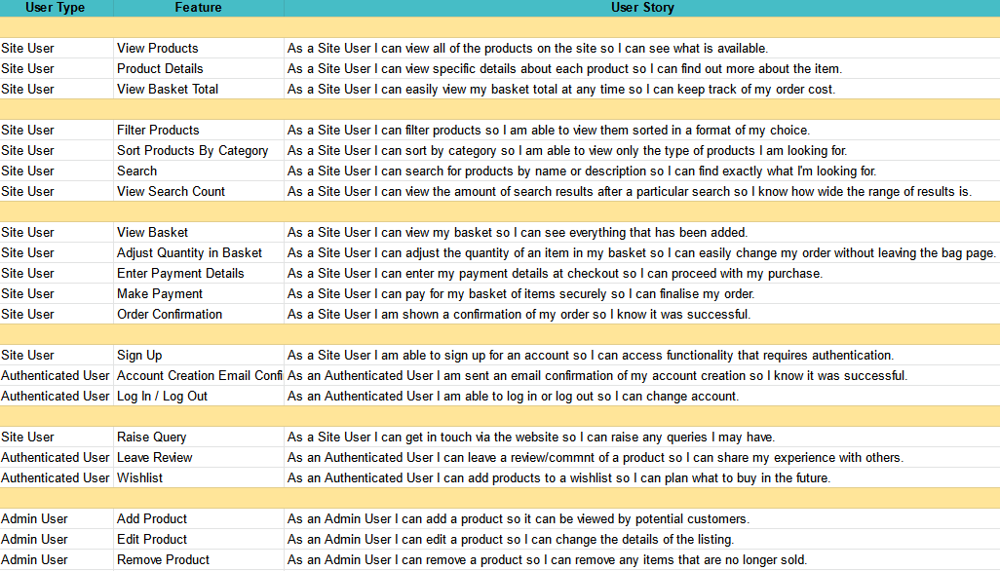

# Tone Henge

[Project live link.](https://tone-henge.herokuapp.com/)


Tone Henge is a full-stack eCommerce project built using Django, Stripe, Heroku and AWS. This data-driven application has built developed using an agile methodology. Github Projects was used to create a kanban-style display used for reviewing iterations and prioritising stories to ensure the efficient product shipping.

This can be viewed [here](https://github.com/jacobshortall/tone-henge/projects/1).

## UX/UI

### User Stories

User stories are seen in the below table.



This sheet is used for mapping user stories to features and epics throughout development. [It can be viewed here](https://docs.google.com/spreadsheets/d/1ob8nIBe4SKKu7h6s5SPkJSnqiatEzivwf0XZelbFMKs/edit?usp=sharing).

### Wireframes

Wireframes assisted keeping to the basic design of the project. These also helped out map the UI in advance. These can be seen [here](readme/general/wireframes.pdf).

### Typography / Colour Scheme

Use of minimal, recurring fonts and colours enforces the brand's consistency across pages. The default font is Helvetica Neue. The font for the logo is bold and eye-catching. The choice for this was Righteous.

The main colours used across the app are red (#dc3545), white (#fff) and a dark grey (#212529). These are consistent with Bootstrap styling for seamless integration.

## Features

### Existing Features

-   View Products.
    -   Users are able to view a list of available products. Each product preview has a snippet of information about the item, and a 'details' prompt to view more.
-   Product Details.
    -   Each product has a dedicated page that displays a full description about the item. Users are offered further functionality from this page, e.g. 'add to basket'.
-   View Basket Total.
    -   The total cost of the user's basket is always in view at the top of the page.
-   Filter Products.
    -   Multiple filtering options are available, allowing the user to select their preferred format.
-   Product Sorting.
    -   Products can be sorted by category, allowing easy navigation to specific types of item.
-   Product Search
    -   A search bar is present in the navigation menu. This searches product names, descriptions and categories and returns a display of all the products that match the criteria.
-   Search Count.
    -   Users are always shown the amount of results being displayed.
-   View Basket.
    -   The basket icon is always available at the top of the navigation menu. Users can click this to access their basket, which will display the items they've added, and a total cost of these items. If empty, it will show a prompt to keep shopping.
-   Adjust Basket Quantity.
    -   Users are able to adjust the quantity of an item in their basket directly from the basket page.
-   Enter Payment Details.
    -   Users are able to click through to the checkout from their basket. From here they can enter their billing details.
-   Make Payment.
    -   Users can make payment using card details (cards will not be charged). This was handled using Stripe.
-   Order Confirmation.
    -   After successful payment, the user is redirected to an order confirmation page, where they are given a review of their order.
-   Sign Up.
    -   Non-authenticated users are able to sign up for an account. This action is available from the navigation account dropdown. There are also prompts across the site in place of content that requires authentication.
-   Account Creation Email.
    -   Users are sent confirmation emails with the details of their new account.
-   Log In/Out
    -   Authenticated users able to log in and out of their accounts from the main navigation. Logged in users are made aware of their authenticated status in the account navigation dropdown.
-   Raise Query.
    -   A contact link is displayed in the footer of the site at all times, which redirects users to a contact page.
    -   These queries are available for admin users to review on a page only they can access.
-   Comments
    -   Authenticated users are able to leave reviews/comments underneath products. This can be used for discussion as well as advising on products.
    -   Users are able to edit/delete comments, if they are the author.
-   Wishlist
    -   Authenticated users are able to add products to a wishlist, so they can come back and review them later. This page is accessible from the navigation account dropdown.
-   Add Product
    -   Admin users are able to add new products that will be rendered to the site.
-   Edit / Delete Products
    -   Admin users are able to edit/remove products to reflect stock changes.
-   Newsletter
    -   A link to a modal that prompts users to sign up to a newsletter is available from the footer across all pages. This is part of the marketing strategy noted in the sections further below.

### Features to Implement in the Future

-   Social Logins.
-   Star review system.

## Database

The schema diagram can be seen below.


### Models

-   Order
    -   Used for storing information regarding a single order. Created upon successful payment.
-   Order Line Item
    -   Stores information about a single product from an order.
    -   Foreign key to Order.
    -   Foreign key to Product.
-   User Query
    -   Stores an email and user query. This is not referenced, nor does it reference any other models.
-   Comment
    -   Store a comment by a particular user on a specific product page.
    -   Foreign key to User (Django built-in).
    -   Foreign key to Product.
-   Wishlist Item
    -   Points to a particular user and specific product. A user can add multiple of these, which can be back-referenced from the User model and iterated through to show a wishlist.
    -   Foreign key to User (Django built-in).
    -   Foreign key to Product.
-   Product
    -   Holds information regarding a specific, unique product.
    -   Foreign key to Category.
-   Category
    -   Holds only a single, unique field: 'name'. Can be added to multiple products.

## Testing

Testing information can be found in [this dedicated document](readme/testing/TESTING.md).

## Technologies

### Languages Used

-   HTML/CSS
-   JavaScript
-   Python

### Frameworks/Libraries Used

-   [Django](https://www.djangoproject.com/)
    -   Used as the backend for this project.
-   [PostgreSQL](https://www.postgresql.org/)
    -   PostgreSQL was used as a Heroku service as the database in deployment.
    -   The database was accessed using Django's built-in ORM.
-   [jQuery](https://jquery.com/)
    -   Used for minimising/optimising JavaScript used in the project.
-   [Stripe](https://stripe.com/gb)
    -   Used to handle payments.
-   [Boostrap](https://getbootstrap.com/)
    -   Used for styling templates.
-   [Git](https://git-scm.com/)
    -   Used for local version control to then push remotely.
-   [GitHub](https://github.com/)
    -   Used to store the project after pushing to Git.
-   [Heroku](https://dashboard.heroku.com/login)
    -   Used to host the application.
-   [AWS S3](https://aws.amazon.com/s3/)
    -   Cloud service used to host and serve static files.
-   [Hover.css](https://ianlunn.github.io/Hover/)
    -   Used for home page button animation.

## Marketing

### Purpose

Tone Henge is made for people looking to purchase instruments online, made easy by simple yet effective UI and UX design. There is also a community aspect of the app, with users being able to comment on products, potentially opening up discussions around items.

### Business Model

Tone Henge is based on a B2C (business to consumer) ecommerce model, where the business in practice would deal and ship directly to the end-user. While it is possible that other businesses, such as schools or music venues, would purchase from the site, they would still effectively be the end-user, and Tone Henge would remain the direct and sole seller of the stock.

### Marketing Strategy

As this is a new business, the main focus is on audience growth and building a strong brand presence amongst potential customers.

In practice, the primary marketing strategy for this application would be social media marketing. This would likely involve both paid and non-paid ad campaigns, targeting a specific demographic of potential customers. The business would initially need to investigate which platforms this demographic is most densely populated on, and begin targeted campaigns.

Users of the site are able to sign up to the newsletter on all pages across the app. This allows for tailored promotions straight to the inbox of users.

-   [View Facebook business page mockup.](/readme/marketing/facebook.pdf)
-   A Mailchimp embedded newsletter form has been included.

## Deployment

This project is deployed to Heroku. It was initially set up on the Heroku website, but hooked up to the git repo via the Heroku CLI.

Steps for deployment:

-   Install Django and relevant dependencies.
-   Create new Django project with appropriate Procfile for Heroku.
-   Run:
    ```
    pip freeze --local > requirements.txt
    ```
-   Ensure all code is committed to Git.
-   Navigate to Heroku, login, and click "create a new app".
-   Enter a unique name for the application, and select the appropriate region.
-   Add PostgreSQL 'hobby' database as a resource. The URL is automatically added to config vars.
-   In the Heroku config vars, ensure 'DEVELOPMENT' is set to 'True' and 'DISABLE_COLLECTSTATIC' is set to '1' during development. Remove these settings when deploying.
-   Link up the Git repo to the new app using:
    ```
    heroku git:remote -a example-app
    ```
-   Deploy the code with:
    ```
    git push heroku main
    ```

Cloning the repository:

-   Navigate to the project repository.
-   In the top right, click "Fork" to fork the repo.
-   After you have your own fork of the repo, click the "Code" button. A dropdown should appear.
-   Copy the HTTPS url and navigate to your local terminal.
-   Clone the repo using the below command:

```
$ git clone "HTTPS URL"
```

## Credit

Product descriptions have been taken from their respective official product page:

-   Strandberg
    -   https://strandbergguitars.com/eu/product/boden-prog-nx-6-plini-edition/
-   Kiesel
    -   https://www.kieselguitars.com/series/guitar/aries
-   Gibson
    -   https://www.gibson.com/en-US/Guitar/USAI9Q269/Les-Paul-Classic/Translucent-Cherry
-   Taylor
    -   https://www.taylorguitars.com/guitars/acoustic/914ce
-   Martin
    -   https://www.martinguitar.com/guitars/standard-series/D-28.html
-   Vox
    -   https://voxamps.com/en-gb/product/ac30-custom/
-   Orange
    -   https://orangeamps.com/products/guitar-amp-combos/crush-pro-series/crush-cr120c/
-   Ernie Ball
    -   https://ernieball.co.uk/guitar-accessories/guitar-straps/polypro-guitar-straps#

Credit to [Ian Lunn](https://github.com/IanLunn/) for the code I used to animate the home page hero image button.
